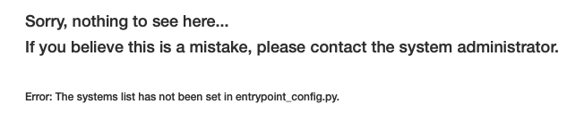
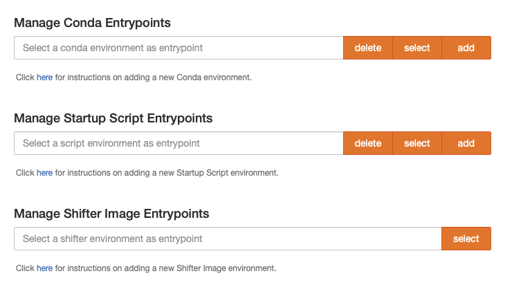
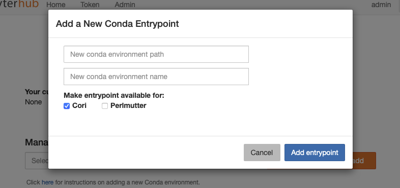

# JupyterHub Entrypoint Service

This is a custom entrypoint service for JupyterHub that maintains a registry 
of entrypoints to launch Jupyter notebooks in through a REST API. Users can
add new entrypoints such as conda envs or make their own through bash scripts,
and then add these entrypoints to the registry. This allows WrapSpawners to 
query the user's preference and launch in that particular environment by
including a pre-launch hook.

Originally developed for use at NERSC.

## Requirements

- jupyterhub
- jinja2
- tornado

#### Optional dependencies (for NERSC use)
- aiocache
- asyncssh

## Installation

    pip install git+https://github.com/Josh0823/entrypoint-service

## How to Configure It

### JupyterHub Configuration
This service can be run as either a hub-managed service or as an external
service. Here's an example configuration for a hub-managed service you can place in a  JupyterHub config file:

    c.JupyterHub.services = [
        {
            'name': 'entrypoint',
            'url': 'http://127.0.0.1:8889',
            'command': ["python", "-m", "jupyterhub_entrypoint"]
        }
    ]

Here's the config if you set it up as an external service, say, in another Docker container called `entrypoint`:

    import os
    c.JupyterHub.services = [
        {
            'name': 'entrypoint',
            'url': 'http://entrypoint:8889',
            'api_token': os.environ["ENTRYPOINT_API_TOKEN"]
        }
    ]

You have to specify the API token for the hub and the entrypoint service to share here.

If you're running a hub with internal SSL turned on, you'll want to take advantage of the SSL option settings.

### Service Configuration
The service also has its own configuration file, by default `entrypoint_config.py`. The configuration text can be generated with a --generate-config option.

Most of the service configuration settings are optional, but in order for the service to usable there are some settings that must be configured.

The `systems` configuration option must be set to maintain different system profiles. For example, at NERSC we have two supercomputer systems, Cori and Perlmutter, that users can set a custom entrypoint for. To properly add configuration for these systems we can add the following to `entrypoint_config.py`:

    c.EntrypointService.systems = [
        {
            'name': 'cori', 
            'displayname': 'Cori', 
            'hostname': 'cori.nersc.gov'
        },
        {
            'name': 'perlmutter', 
            'displayname': 'Perlmutter', 
            'hostname': 'perlmutter.nersc.gov'
        }
    ]

- `name` is used to form the path for API endpoints and file paths and should not have any characters such as spaces or slashes that can invalidate paths. Numbers and letters are good.

- `displayname` is how the system is labeled in the UI. Use all the spaces and slashes you want.

- `hostname` is the DNS domain name. This is not used by default but can be used to handle validation through ssh. If you do not want to use a hostname, include an empty string

Next the `entrypoint_types` configuration option must be set to allow users the option to manage different entrypoint types. For example, at NERSC we currently support conda environments, shifter images, and custom startup bash scripts. To properly add configuration for these entrypoint types we can add the following to `entrypoint_config.py`:

    c.EntrypointService.entrypoint_types = [
        {
            'name': 'conda', 
            'displayname': 'Conda', 
            'mutable': True
        },
        {
            'name': 'script', 
            'displayname': 'Startup Script', 
            'mutable': True
        },
        {
            'name': 'shifter', 
            'displayname': 'Shifter Image', 
            'mutable': False
        }
    ]

- `name` is used to form the path for API endpoints and file paths and should not have any characters such as spaces or slashes that can invalidate paths. Numbers and letters are good.

- `displayname` is how the system is labeled in the UI. Use all the spaces and slashes you want.

- `mutable` controls whether the UI should include options to add and delete a given entrypoint type. This is useful if an administrator wants to control available entrypoints or if those entrypoints are set in a separate service. At NERSC, available shifter images are set through a separate API, so `mutable` is set to false above.

Other important configuration settings include:
- `c.EntrypointService.additional_handlers`
    - Custom endpoints and handlers can be set by including Tornado handler tuples. These tuples include the endpoint, the tornado.web.RequestHandler class, and a dict of variables need to initialize the handler
- `c.EntrypointService.storage_path`
    - This is the path location of where user entrypoints will be stored. By default the files will be stored at './data', which is relative to where jupyterhub_entrypoint is installed.
- `c.APIBaseHandler.validator`
    - By default when users submit a new entrypoint there is no check to ensure the path is valid. This can be configured by writing a new Python class that extends the BaseValidator from `jupyterhub_entrypoint.api`. See `validate.py` for an example of a validator that uses asyncssh to ensure conda envs exist and that bash scripts are executable.

## How to Use It

First start up the hub and if you are running locally on port 8000 go to:

    http://localhost:8000/services/entrypoint

If the service was installed correctly you should see one of two screens. If the systems configuration option was not set or not loaded properly then you will see the following message:

If the systems configuration option was set then you see two rows of buttons. The large orange button is used to clear the current selected entrypoint. The second row of blue buttons will change the current selected system:

Then for every entrypoint type set in the configuration options there will be an input box to manage those types. If the entrypoint type is mutable there will be an add and delete button along with the select button:

Using the Manage Entrypoint input boxes, users can use the input box to select previously set entrypoints. These entrypoints can then be selected as the current entrypoint or deleted. For mutable entrypoints, the add button can be used to input information for a new entrypoint:

[ADD SECTION ABOUT INTERFACING WITH WRAPSPAWNER]

## REST Endpoints

Additional endpoints and custom API handlers can be set through the
configuration settings. The following default endpoints are set when
the service starts:

> /services/entrypoint/users/{user}/systems/{system}   
Main endpoint used to access and modify the profile for a given user  
> - GET Returns the current selected entrypoint for a given system for a given user   
> - POST Can add a new entrypoint or update the current selected entrypoint   
> - DELETE Can clear the current selected entrypoint or remove an entrypoint option

> /services/entrypoint/validate/users/{user}/systems/{system}   
Endpoint used to re-validate the given's user's selected entrypoint for a given system   
> - GET Returns a json object {result: bool, message: str} of whether the endpoint was validated and any error messaging.

> /services/entrypoint/entrypoints/users/{user}/type/{type}?system={system}   
> - GET Returns all available entrypoints of a given type for a given user and system